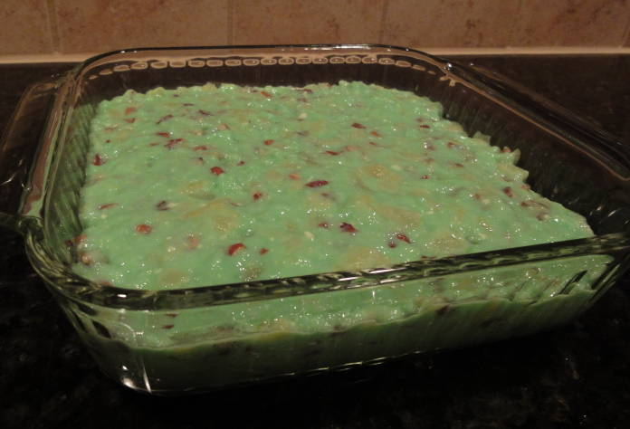
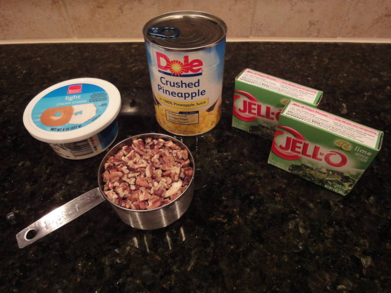
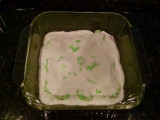
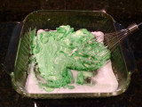
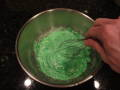
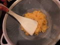
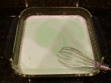
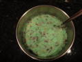

# Ingredients

- 6oz lime jello
- 8oz package of low fat cream cheese
- 20oz can crushed pineapple
- 1 cup chopped pecans
- water

# Directions

1. Break cream cheese into small chunks and place in a 2 qt, 8" square baking dish. Let it sit out until it comes to room temperature (2 hours or more). Starting out in a mixing bowl would make the later whisking steps easier, but this way saves a dirty dish.

    

1. Empty jello powder over the cream cheese and whisk until incorporated.

    
    
    

1. Strain pineapple, reserving juice. Press pineapple with a spatula to extract as much juice as possible.

    

1. Add enough water to the pineapple juice to produce 2 cups of liquid. Bring to near boiling.
1. Pour the juice/water mixture over the jello and cream cheese mixture, and stir well to dissolve.

    

1. Add pineapple and nuts and mix well.

    

1. Refrigerate until set, maybe 4 hours.

# Try next time

- Straining the pineapple is annoying, and then you have to clean the strainer afterwards. Instead, consider boiling just 1 cup of water and mixing that with the jello and cream cheese mixture. When adding the pineapple and nuts, add the entire undrained can of pineapple.
