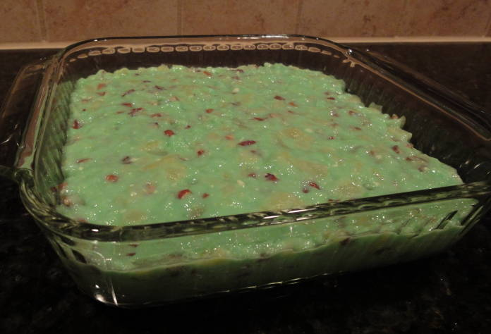
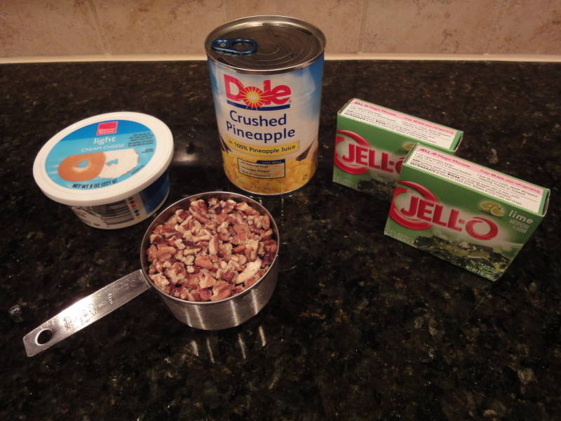
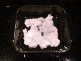
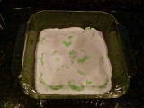
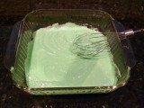
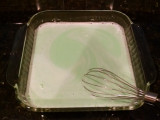
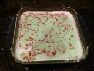

# Ingredients

- 6oz lime jello
- 8oz package of low fat cream cheese
- 20oz can crushed pineapple
- 1 cup chopped pecans
- water

# Directions

1. Break cream cheese into small chunks and place in a mixing bowl. Let it sit out until it comes to room temperature (2 hours or more).

    

1. Empty jello powder over the cream cheese and whisk until incorporated.

    
    
    
    

1. Drain pineapple, reserving juice. Press pineapple with a spatula to extract as much juice as possible.

    

1. Add enough water to the pineapple juice to produce 2 cups of liquid. Bring to near boiling.
1. Pour juice/water mixture over jello / cream cheese mixture, and stir well to dissolve.

    

1. Pour 1 cup cold water into mixture and stir well.
1. Transfer to the final serving dish. A 2 qt, 8" square baking dish should be fine. (Note: The next photos show the mixture in the original mixing bowl. They were taken before my current recommendation of transferring to the final dish at this stage.)
1. Refrigerate until just starting to firm up, maybe about 1-2 hours. It should be jiggly in the middle, firm enough to prevent nuts from sinking but not much firmer.

    

1. Add pineapple and nuts and mix well.

    
    

1. Refrigerate until set, maybe 2 hours.

# Options

- Consider doing the initial mixing in the final dish to avoid getting a separate bowl dirty.
- One recipe calls for just 2 cups of liquid. You boil 2 cups of pineapple juice and water, and pour this over the jello and cream cheese. Then, instead of letting it firm up a little first, you immediately mix in the pineapple and nuts, and then refrigerate until set.
